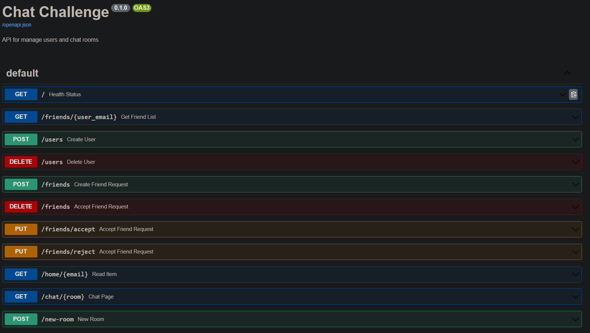
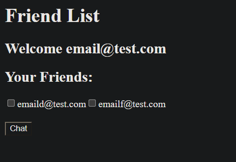

# Demo Link

## Swagger Docs

Link: [Docs](https://dymaxion.nonprod.link/docs)

(https://dymaxion.nonprod.link/docs)




## Home

Link: [Home](https://dymaxion.nonprod.link/home/email@test.com)

(https://dymaxion.nonprod.link/home/email@test.com)



<br/><br/>
# Running Tests

Run all tests:
```bash
pytest
```

Run module tests example:
```bash
pytest tests/integration/test_users.py 
```

Run specific test example:
```bash
pytest -k "test_create_user"
```
<br/><br/>
# Running Application

## Run app
```bash
docker build -t dymaxion .
docker run -dp 8000:8000  --name dycontainer dymaxion
```

<br/><br/>
# Setting up for developmenet


## Create virtual environment

```bash
python3 -m venv venv
```

## Activate venv
```bash
. venv/bin/activate
```

## Freeze dependencies

```bash
pip freeze > requirements.txt
```

## Install requirements

```bash
pip install -r requirements.txt
```

## Run project

```bash
uvicorn main:app --reload
```

<br/><br/>
# Deploy

## Push to AWS ECR
```bash
export AWS_ACCESS_KEY_ID=****
export AWS_SECRET_ACCESS_KEY=****
docker build -t 085419913565.dkr.ecr.us-east-1.amazonaws.com/dymaxion_challenge .
docker push 085419913565.dkr.ecr.us-east-1.amazonaws.com/dymaxion_challenge
```
